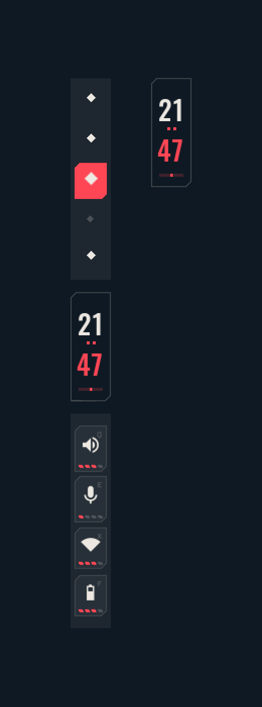
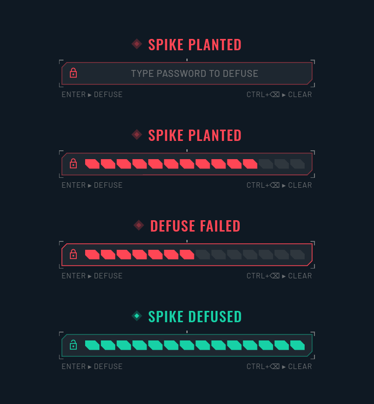
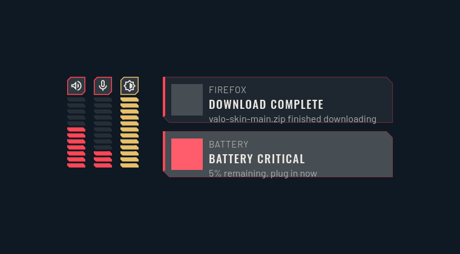
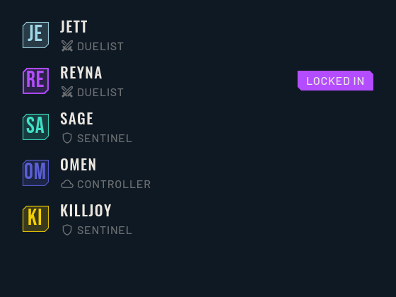
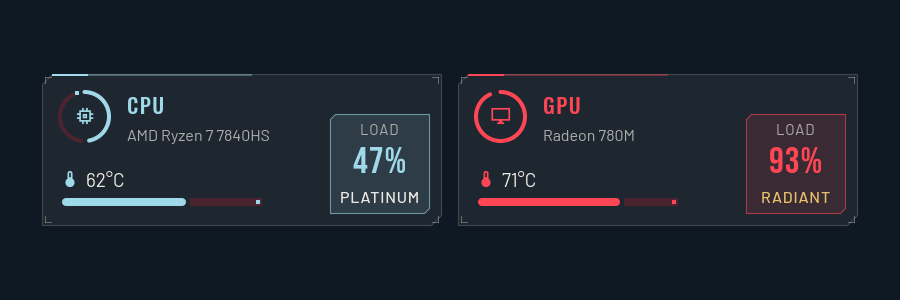
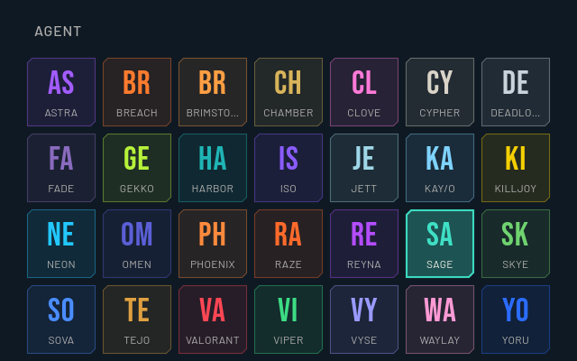
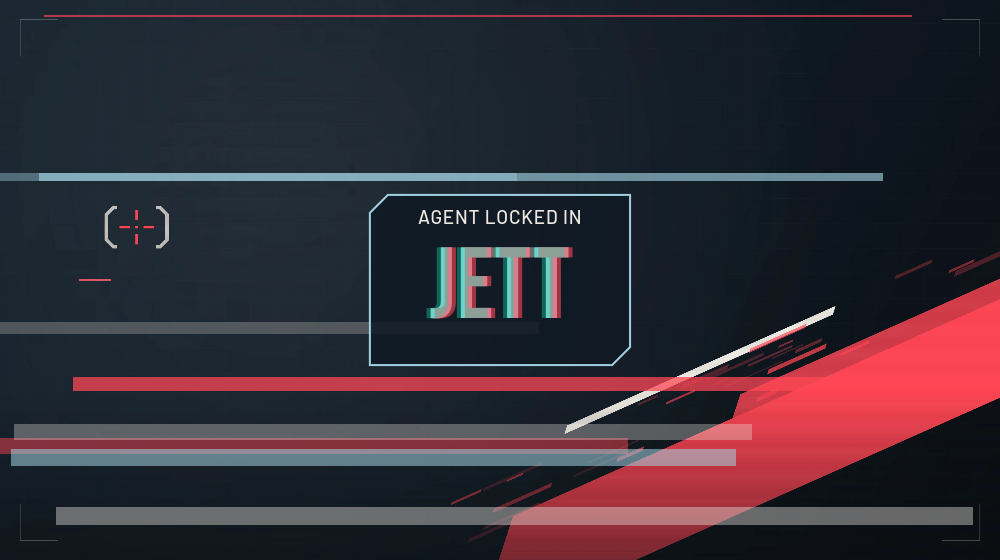
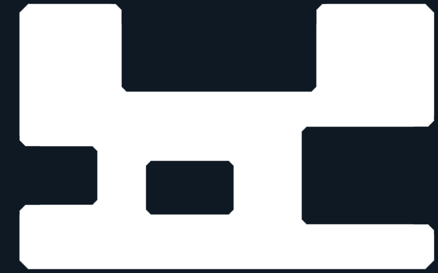
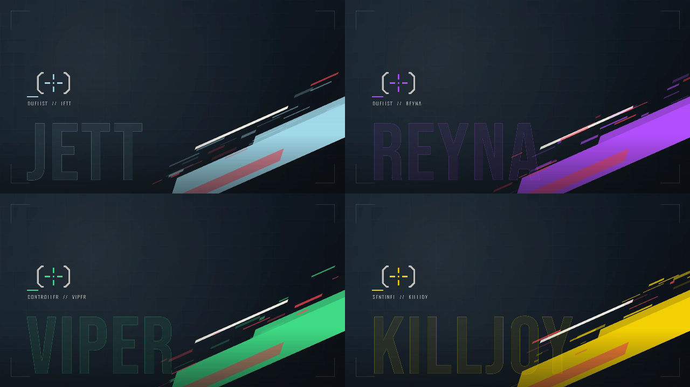
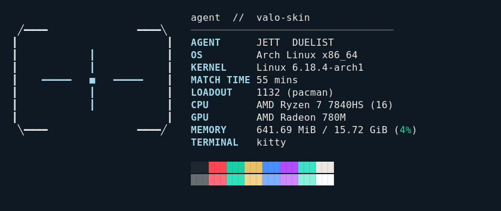

<h1 align=center>VALO-SKIN</h1>

<p align=center><b>A Valorant-themed Hyprland rice built on Caelestia / Sidera shell</b></p>

<p align=center>
  
</p>

Valo-skin restyles the [Sidera](https://github.com/tarbai771/sidera-shell) fork of
[Caelestia Shell](https://github.com/caelestia-dots/shell) to look and feel like Valorant's HUD:
navy and red, sharp chamfered corners, condensed all-caps type, and per-agent colour themes you can
switch at any time.

> [!NOTE]
> Valo-skin is a fan project. It is not affiliated with, endorsed by, or sponsored by Riot Games.
> No Riot Games assets ship in this repo. The logo, wallpaper and palette are original, and the fonts
> are free (SIL OFL) lookalikes. Valorant is a trademark of Riot Games, Inc.

## Features

| | Status |
|---|---|
| Valorant palette (navy `#0f1923`, red `#ff4655`, off-white `#ece8e1`) generated as a full Material 3 scheme | ✅ |
| **27 agent themes** plus classic Valorant red: lock in an agent to recolour the whole shell with their signature accent | ✅ |
| Dark and light modes | ✅ |
| **Chamfered panels**: real 45° bevels on every SDF-drawn panel, join and screen-frame corner (GPU shader) | ✅ |
| Sharp corners on every other surface (rounding off by default) | ✅ |
| Valorant-style type: Bebas Neue headlines, Oswald titles, Barlow body, uppercase with letter spacing (bundled) | ✅ |
| Material Symbols **Sharp** icons (bundled) | ✅ |
| Original crosshair emblem and tactical wallpaper | ✅ |
| Hot-reloaded `valorant.json`, launcher actions and IPC for agents, accent, mode | ✅ |
| **HUD bar**: round-timer clock (drains every minute, red for the last 10 s), ability-slot status icons with charge pips, diamond rank-pip workspaces | ✅ |
| **Spike-plant lock screen**: typing fills the defuse bar; planted, defusing, failed (with shake), detonated and defused states | ✅ |
| **Kill-banner notifications**: slanted chamfered cards with urgency-coloured stripe and arrival flash | ✅ |
| **Ability-charge OSD**: volume, mic and brightness as stacked charge pips that turn gold at max | ✅ |
| Every HUD piece can be turned off on its own in `valorant.json` → `hud` | ✅ |
| **Agent select**: `>agent` launcher mode with agent tiles, roles and a Locked in tag | ✅ |
| **Match-stats dashboard**: HUD-framed cards; CPU/GPU load shown as a rank tier (Iron → Radiant) | ✅ |
| **Settings page**: agent grid plus every Valorant option and HUD toggle under Wallpaper & style | ✅ |
| **Lock-in glitch**: switching agents plays a glitch flourish with an "Agent locked in" banner | ✅ |
| **Scanlines**: optional scanline texture on panels, drawn in the panel shader | ✅ |
| **Whole-desktop agent sync**: Hyprland borders, kitty/foot/alacritty, fastfetch, GTK 3/4 and Qt recolour automatically on agent switch (`valo-sync`) | ✅ |
| **Hyprland look**: sharp corners, rotating accent-gradient borders, hard shadows, snappy "valoSnap" animations, agent keybinds (Lua and hyprlang) | ✅ |
| **Valo-Crosshair cursor theme**: original angular cursors and a Valorant-style crosshair, tinted per agent | ✅ |
| **One-shot installer** for Arch and Fedora with backups, idempotent re-runs and `--uninstall` | ✅ |
| **Agent wallpapers**: an original wallpaper per agent (accent shards, name and role), swapped on lock-in | ✅ |
| **UI sounds**: original synthesized lock-in, spike plant/defuse, failed-defuse and kill-banner sounds | ✅ |

## Previews

Offscreen renders of the real components (stubbed system data):

| Bar | Spike lock | OSD + kill banners |
|---|---|---|
|  |  |  |

| Agent select | Match stats | Settings | Lock-in glitch |
|---|---|---|---|
|  |  |  |  |

Chamfer-mode panel shader (navy = panels and screen frame):



Agent wallpapers (Jett, Reyna, Viper, Killjoy):



| fastfetch (illustrative system values) | Valo-Crosshair cursors |
|---|---|
|  |  |

## Install

```sh
git clone https://github.com/aditya36900/Valo-skin.git ~/Valo-skin
cd ~/Valo-skin
./install.sh            # --dry-run to preview, --help for options
```

The installer:

1. installs packages (Arch: pacman plus `quickshell-git` from the AUR via paru/yay; Fedora: dnf);
2. builds the shell into `~/.config/quickshell/caelestia`;
3. installs `valo-sync`, the fonts and the Valo-Crosshair cursor;
4. adds one tagged include line each to your Hyprland, kitty, foot and GTK configs (with backups).

Flags: `--no-deps`, `--no-shell`, `--no-dots`, `--hypr=lua|conf`, `-y`, `--uninstall`.
See [docs/DOTFILES.md](docs/DOTFILES.md) for exactly what changes.

Then log into Hyprland, or start the shell with `qs -c caelestia`.

<details><summary>Manual build (shell only)</summary>

```sh
cmake -B build -G Ninja -DCMAKE_BUILD_TYPE=Release -DCMAKE_INSTALL_PREFIX=/ \
      -DINSTALL_QSCONFDIR=~/.config/quickshell/caelestia
cmake --build build
sudo cmake --install build
```

Requires the **git** version of Quickshell and Qt 6.9+. For the full dependency list see
[docs/CAELESTIA.md](docs/CAELESTIA.md#manual-installation), or [FEDORA.md](FEDORA.md) on Fedora.
</details>

> [!IMPORTANT]
> The chamfered panels, scanlines and the new font and rounding defaults live in the C++ plugin,
> so **rebuild** after pulling updates (re-running `./install.sh --no-dots` does this).

## Configuration

Valo-skin adds one file, `~/.config/caelestia/valorant.json`. It's created with defaults on first
launch, and changes apply live. A fully commented reference is in
[docs/VALORANT.md](docs/VALORANT.md), and a ready-to-copy example in
[docs/valorant.example.json](docs/valorant.example.json).

```json
{
    "agent": "jett",
    "mode": "dark",
    "overrideScheme": true,
    "accent": "",
    "shape": { "chamfer": 10 }
}
```

The usual Caelestia config (`~/.config/caelestia/shell.json`) still works. Valo-skin only changes
its defaults:

| Option | Valo-skin default | Upstream |
|---|---|---|
| `appearance.rounding.scale` | `0` (sharp) | `1` |
| `appearance.font.headline.family` | `Bebas Neue` | `GoogleSansFlex` |
| `appearance.font.title.family` | `Oswald` | `GoogleSansFlex` |
| `appearance.font.{body,label}.family` | `Barlow` | `GoogleSansFlex` |
| `appearance.font.icon.family` | `Material Symbols Sharp` | `Material Symbols Rounded` |
| `appearance.font.{headline,title,label}.uppercase` | `true` | new option |
| `appearance.font.{headline,title,label}.letterSpacing` | `1` / `1.5` / `0.8` | new option |
| `border.thickness` / `rounding` / `smoothing` | `8` / `18` / `12` | `10` / `25` / `20` |
| `bar.statusIcons` → `audio` | enabled | disabled |

### Switching agents

```sh
qs -c caelestia ipc call valorant agent reyna    # or: caelestia shell valorant agent reyna
qs -c caelestia ipc call valorant next           # cycle forward / prev
qs -c caelestia ipc call valorant list           # all agents with role and accent
qs -c caelestia ipc call valorant accent '#00ffcc'   # custom accent ("reset" to undo)
qs -c caelestia ipc call valorant mode light
qs -c caelestia ipc call valorant toggle         # Valorant palette <-> wallpaper scheme
```

In the launcher, type `>agent ` to search and lock in an agent, or use the **Next agent**,
**Previous agent** and **Valorant palette** actions. Every option is also in
**Settings → Wallpaper & style → Valorant**. Picking
any scheme from the launcher's scheme list hands colours back to the wallpaper scheme. Run
`valorant toggle` (or set `overrideScheme` back to `true`) to return.

## Credits and licence

- [Caelestia Shell](https://github.com/caelestia-dots/shell) by soramane and contributors, the
  foundation of everything here. The original README is kept at [docs/CAELESTIA.md](docs/CAELESTIA.md).
- [Sidera](https://github.com/tarbai771/sidera-shell), the Fedora-focused fork Valo-skin is based on.
- [Quickshell](https://quickshell.outfoxxed.me) by outfoxxed.
- Fonts: [Bebas Neue](https://github.com/dharmatype/Bebas-Neue), [Oswald](https://github.com/googlefonts/OswaldFont)
  and [Barlow](https://github.com/jpt/barlow) under the SIL Open Font License;
  [Material Symbols](https://github.com/google/material-design-icons) under Apache 2.0. Licence texts
  are in [assets/fonts](assets/fonts).

Valo-skin is released under the GNU GPLv3, the same as upstream. See [LICENSE](LICENSE).
