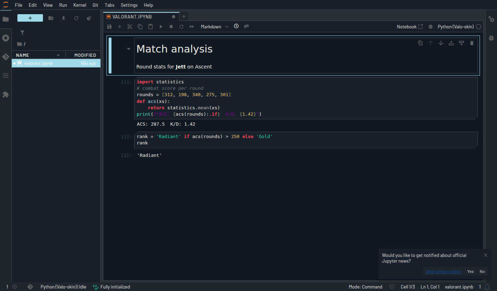

# Coding tools

`scripts/dev-tools.sh` sets up a full development loadout on **Arch** or **Fedora**. Run it on
its own, or as part of the main installer with `./install.sh --dev`.

```sh
scripts/dev-tools.sh                       # checklist (whiptail) with the recommended modules ticked
scripts/dev-tools.sh -y                    # recommended modules, no questions
scripts/dev-tools.sh --all -y              # everything
scripts/dev-tools.sh --only python,jupyter,vscode,rust
scripts/dev-tools.sh --list                # modules
scripts/dev-tools.sh --all --dry-run       # print every command without running anything
```

Each module runs on its own: if one fails (no network, a missing AUR helper), the rest still
install and the summary tells you what to re-run. Re-running is safe.

| Module | Installs | Rec. |
|---|---|---|
| `core` | gcc/clang, cmake, ninja, gdb, make, ripgrep, fd, fzf, bat, eza, zoxide, jq, tmux, btop, direnv | ✓ |
| `git` | GitHub CLI, lazygit, git-delta | ✓ |
| `vscode` | VS Code (Arch: `visual-studio-code-bin` via AUR, else the OSS `code`; Fedora: Microsoft repo) plus extensions: Python, Jupyter, Ruff, rust-analyzer, Go, clangd, Docker, ESLint, Prettier, GitLens | ✓ |
| `vscodium` | VSCodium with the same extensions | |
| `neovim` | Neovim, Helix, pynvim | ✓ |
| `jetbrains` | JetBrains Toolbox in `~/.local/share/JetBrains/Toolbox` (installs IntelliJ, PyCharm, CLion, ... on demand) | |
| `python` | Python, pip, pipx, uv, ruff, pyright | ✓ |
| `jupyter` | JupyterLab + Notebook 7 + jupyterlab-git + LSP in an isolated env (`~/.local/share/valo-skin/jupyter`), commands linked into `~/.local/bin`, a "Python (Valo-skin)" kernel, dark theme + Valorant `custom.css` | ✓ |
| `datasci` | `~/.venvs/datasci` with numpy, pandas, polars, pyarrow, matplotlib, seaborn, scipy, scikit-learn, statsmodels, plotly, registered as the "Python (data science)" kernel | |
| `node` | Node.js, npm, corepack (pnpm/yarn), TypeScript + language server | ✓ |
| `rust` | rustup with stable, clippy, rustfmt, rust-analyzer | ✓ |
| `go` | Go + gopls | ✓ |
| `java` | OpenJDK 21, Maven, Gradle | |
| `cpp` | clangd/clang-tools, lldb, valgrind, ccache, meson, bear | ✓ |
| `docker` | Docker Engine, Compose, Buildx (enabled, you're added to the `docker` group) | |
| `podman` | Podman + podman-compose | |
| `databases` | SQLite, PostgreSQL, Valkey (installed, not started) | |
| `cloud` | kubectl, helm, OpenTofu, AWS CLI | |
| `gui` | Flatpak: Postman, DBeaver, GitHub Desktop | |

## Valorant theming for the tools

`valo-sync` themes these as well, following the agent like the rest of the desktop:

- **VS Code / VSCodium / Cursor**: the "Valorant (Valo-skin)" colour theme (installed as a local
  extension; `install.sh` selects it when your `settings.json` has no comments)
- **JupyterLab / Notebook 7**: `~/.jupyter/custom/custom.css` with the agent palette, chamfered
  cells and an accent strip on the active cell (`c.LabApp.custom_css = True` is added for you)
- **Neovim**: `:colorscheme valorant`
- **btop**, **kitty/foot/alacritty** and the GTK/Qt apps, as in [DOTFILES.md](DOTFILES.md)

JupyterLab 4.6 with the Jett theme (real screenshot):



Testing hooks: `VALO_DISTRO=arch|fedora` overrides distro detection, and `VALO_SKIP_PKG=1` skips
distro package installs (used to test the uv-based modules in CI-like environments).
