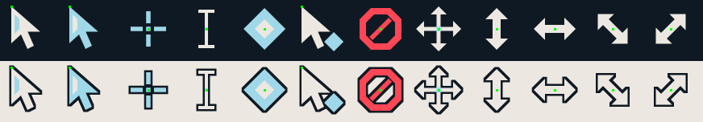
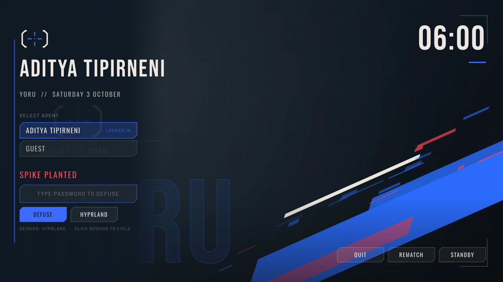
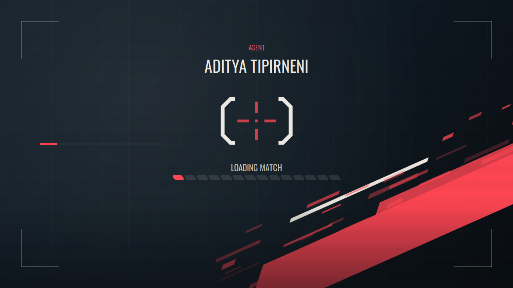

# Valo-skin dotfiles

Everything outside the shell follows the current agent. When you switch agents (launcher,
settings, `SUPER+ALT+←/→` or IPC), the shell publishes its colour scheme to
`~/.local/state/caelestia/valorant-scheme.json` and runs **`valo-sync`**. That script rewrites
small colour *include* files and reloads what it can. Your own config files are never rewritten.

| App | File valo-sync writes | How it's included | Live reload |
|---|---|---|---|
| Hyprland (Lua) | `~/.config/hypr/valorant-colors.lua` | `valorant.lua` requires it; your `hyprland.lua` gets `require("valorant")` | `hyprctl reload` |
| Hyprland (hyprlang) | `~/.config/hypr/valorant-colors.conf` | `valorant.conf` sources it; `hyprland.conf` gets `source = …/valorant.conf` | `hyprctl reload` |
| kitty | `~/.config/kitty/valorant.conf` | `include valorant.conf` in `kitty.conf` | SIGUSR1 |
| foot | `~/.config/foot/valorant.ini` | `include=…/valorant.ini` in `foot.ini` | SIGUSR1 |
| alacritty | `~/.config/alacritty/valorant.toml` | `[general] import` (created if you have no `alacritty.toml`) | automatic |
| fastfetch | `~/.config/fastfetch/valorant.jsonc` + emblem logo | `config.jsonc` symlink if you have none, else `fastfetch -c valorant` | next run |
| GTK 3 / 4 (libadwaita, adw-gtk3) | `~/.config/gtk-{3,4}.0/valorant.css` | `@import 'valorant.css';` at the top of `gtk.css` | restart the app |
| Qt (qt5ct / qt6ct) | `~/.config/qt{5,6}ct/colors/valorant.conf` | `custom_palette` + `color_scheme_path` in `qt{5,6}ct.conf` | restart the app |
| Cursor | `~/.local/share/icons/Valo-Crosshair` (rebuilt in your accent) | `XCURSOR_THEME`, `~/.icons/default`, gsettings | new windows |
| btop | `~/.config/btop/themes/valorant.theme` | `color_theme = "valorant"` set in `btop.conf` | SIGUSR2 |
| Neovim | `~/.config/nvim/colors/valorant.lua` (no plugins needed) | `vim.cmd.colorscheme('valorant')` in your config | re-applied over RPC in running instances |
| VS Code / VSCodium / Cursor | `~/.vscode*/extensions/valo-skin.valorant-theme-1.0.0` | `workbench.colorTheme` set if `settings.json` has no comments | Reload Window |
| Firefox / LibreWolf / Zen (`--firefox`) | `<profile>/chrome/valorant-colors.css` + static `valorant.css` | `@import` in `userChrome.css`, pref in `user.js` | restart |
| Vesktop / Vencord / Equibop | `~/.config/<client>/themes/valorant.theme.css` | enable it in Settings → Themes | automatic |
| Spicetify | `~/.config/spicetify/Themes/Valorant/` (`color.ini` scheme `agent`) | `spicetify config current_theme Valorant` | `spicetify refresh -s` |
| JupyterLab / Notebook 7 | `~/.jupyter/custom/custom.css` | `c.LabApp.custom_css = True` (set by `dev-tools.sh --only jupyter`) | reload the page |

App themes are only generated when the app is installed (Firefox only for profiles you opt in
with `--firefox`). Editors, btop and the Firefox userChrome all get sharp, chamfer-style corners
where the app allows it.

Every line the installer adds ends with a `valo-skin` tag, so `./install.sh --uninstall` can find
and remove it. It backs up every file it touches to `~/.local/share/valo-skin/backups/<date>/`.
If the installer had to create `qt5ct.conf`/`qt6ct.conf`, uninstall leaves that file behind with
only `custom_palette=false` (the default).

## Hyprland look

`dots/hypr/valorant.lua` (and the equivalent `valorant.conf`) sets:

- auto-tiling: dwindle splits along the focused window's longer side and keeps splits; `SUPER+ALT+T`
  (or the layout button in the bar) cycles dwindle / master / scrolling, and the choice survives
  config reloads
- 2 px borders with a rotating agent-accent → red gradient; inactive borders in the outline colour
- `rounding = 0`, gaps 4/8 to match the shell's screen frame, hard 4 px offset shadows, blur on
- "valoSnap" animations: quick slides with a slight overshoot, vertical workspace slides
- the Valo-Crosshair cursor and the `qt6ct` platform theme via env
- extra binds:

| Bind | Action |
|---|---|
| `SUPER+ALT+→` / `←` | Next / previous agent |
| `SUPER+ALT+A` | Agent quick-switch ring |
| `SUPER+ALT+V` | Valorant palette ↔ wallpaper scheme |
| `SUPER+ALT+L` / `D` | Light / dark mode |
| `SUPER+ALT+S` | Re-run valo-sync |
| `SUPER+ALT+T` | Next tiling layout |
| `SUPER+ALT+M` | Minimize the focused window to the bench |
| `SUPER+ALT+SHIFT+M` | Restore the last benched window |

It's loaded *after* your own settings, so it wins on conflicts. To change something, put your
override after the `require("valorant")` / `source` line.

## valo-sync

```sh
valo-sync                    # apply the scheme the shell last published
valo-sync --dry-run          # show what would change
valo-sync --only kitty,gtk   # limit targets
valo-sync --accent '#00ffcc' # custom accent without the shell (add --light for light mode)
valo-sync --print            # dump the scheme JSON
```

It only writes files whose content changed, and only reloads apps when something did. To stop
the shell running it automatically, set `"syncDotfiles": false` in `valorant.json`.

The fallback scheme (used before the shell has published one, or with `--accent`) is a Python
port of the shell's generator. It produces the exact same hex values.

## Agent portraits

```sh
valo-agent-art            # or: ./install.sh --no-deps --no-shell --no-dots --agent-art
```

Downloads every agent's full portrait and name art from the community
[valorant-api.com](https://valorant-api.com) into `~/.local/share/valo-skin/agent-art/` (about
40 MB). Nothing from Riot is shipped in this repo; the files stay on your machine. The shell then
draws the current agent's portrait over the wallpaper and slides it in on lock-in, and the next
`./install.sh --sddm` puts it on the login screen. `--force` re-downloads, `--only jett,yoru` limits
it, `--remove` deletes it, and `"agentArt": false` in `valorant.json` hides it.

## Cursor theme

`valo-cursors` draws the Valo-Crosshair XCursor theme in pure Python at 24/32/48/64 px: angular
arrows with an accent stripe, an accent pointer, a Valorant-style crosshair, an I-beam, a spike
"busy" diamond, and chamfered resize/move glyphs. Run `valo-cursors --accent '#rrggbb'` to tint it
yourself. Anything it doesn't draw falls back to Adwaita.



## Login screen and boot splash (opt-in)

```sh
./install.sh --no-deps --no-shell --no-dots --sddm --plymouth --player="Your Name"
```

`--player` saves your name to `valorant.json` and writes it onto both screens (the login headline and
your account card, and "AGENT / YOUR NAME" above the boot crosshair). Without it the installer uses
`player.name` from `valorant.json`, then your account's full name.

**SDDM** (`themes/sddm/valo-skin`, Qt 6): a Valorant main-menu style login. Users are listed as
agents to lock in, the password field is a spike defuse bar (planted → defusing → failed with a
shake, or defused), and there's a round-timer clock plus Quit / Rematch / Standby buttons. The
installer copies the fonts, uses the current agent's wallpaper and accent, and writes
`/etc/sddm.conf.d/10-valo-skin.conf`. Re-run it with `--sddm` after switching agents to update the
login screen.

**Plymouth** (`themes/plymouth/valo-skin`, script plugin): "Loading match" with a pulsing
crosshair, 14 progress cells, boot messages, and a "Spike planted" passphrase prompt for encrypted
disks. Needs Plymouth's label plugin for text (Fedora: `plymouth-plugin-label`; included on Arch).
On Fedora the installer rebuilds the initramfs; on Arch it runs `mkinitcpio -P` if the `plymouth`
hook is configured, and tells you what to add otherwise. Add `splash` to your kernel command line.

`--uninstall` removes both, re-enables your previous login manager and restores your previous
Plymouth theme.

| SDDM | Plymouth |
|---|---|
|  |  |
